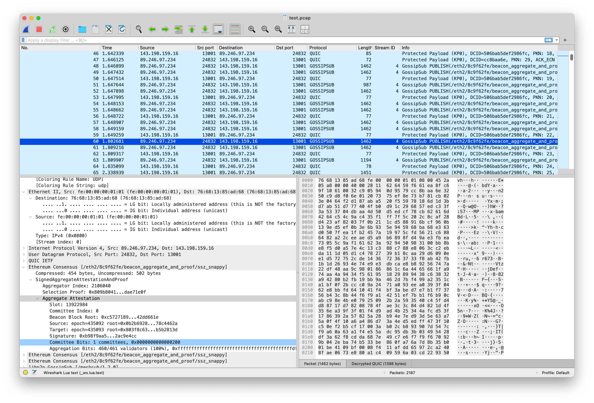

# Wireshark Dissectors

A collection of Wireshark Dissectors for analyzing libp2p and Ethereum
Consensus Client packet traces. Only works for QUIC connections.




##  Goals of this Test Repository

The long-term vision of this test repository is to become a unified observability and experimentation framework for libp2p-based distributed systems, enabling protocol debugging, interoperability testing, AI-assisted packet analysis, decentralized networking research, and large-scale coordination experiments across Web3, edge AI, Ethereum, IPFS, Filecoin, and next-generation peer-to-peer infrastructure.


## Usage

Run `make install` or manually move the Lua files into [Wireshark's Plugin directory](https://www.wireshark.org/docs/wsug_html_chunked/ChPluginFolders.html)

When collecting the packet trace, make sure to log the TLS keys used. Refer to
Wireshark's [documentation](https://wiki.wireshark.org/TLS#tls-decryption) for
details. There are Prysm specific details in CAPTURE.md, but these dissectors
are client agnostic.

## Tips

Claude can use `tshark` as well as these dissectors to answer all sorts of questions about a packet trace.

Example:

```
❯ Break down bandwidth usage of prysm.pcap by gossipsub topic

● In the 3-minute Prysm capture:

  ┌───────────────────────────────────────┬──────────┬────────┬──────────┬──────────────┐
  │                 Topic                 │ Messages │ Bytes  │ Avg Size │ % of Traffic │
  ├───────────────────────────────────────┼──────────┼────────┼──────────┼──────────────┤
  │ beacon_aggregate_and_proof            │ 7,088    │ 3.1 MB │ 461 B    │ 56.0%        │
  ├───────────────────────────────────────┼──────────┼────────┼──────────┼──────────────┤
  │ beacon_block                          │ 13       │ 1.1 MB │ 86 KB    │ 19.5%        │
  ├───────────────────────────────────────┼──────────┼────────┼──────────┼──────────────┤
  │ beacon_attestation_51                 │ 1,715    │ 378 KB │ 225 B    │ 6.6%         │
  ├───────────────────────────────────────┼──────────┼────────┼──────────┼──────────────┤
  │ beacon_attestation_50                 │ 1,395    │ 307 KB │ 224 B    │ 5.4%         │
  ├───────────────────────────────────────┼──────────┼────────┼──────────┼──────────────┤
  │ data_column_sidecar (8 subnets)       │ 58       │ 640 KB │ ~11 KB   │ 10.9%        │
  ├───────────────────────────────────────┼──────────┼────────┼──────────┼──────────────┤
  │ sync_committee_contribution_and_proof │ 261      │ 89 KB  │ 350 B    │ 1.6%         │
  └───────────────────────────────────────┴──────────┴────────┴──────────┴──────────────┘

❯ For beacon_aggregate_and_proof, how much traffic is from duplicate messages?

● 59% of beacon_aggregate_and_proof traffic is duplicates — the same (slot, aggregator_index) pair received from multiple peers.
```

Run Claude from this repo to inherit this repo's CLAUDE.md to make the above queries easier.

## Contributing

All changes must be accompanied with tests and relevant packet traces to test with.
